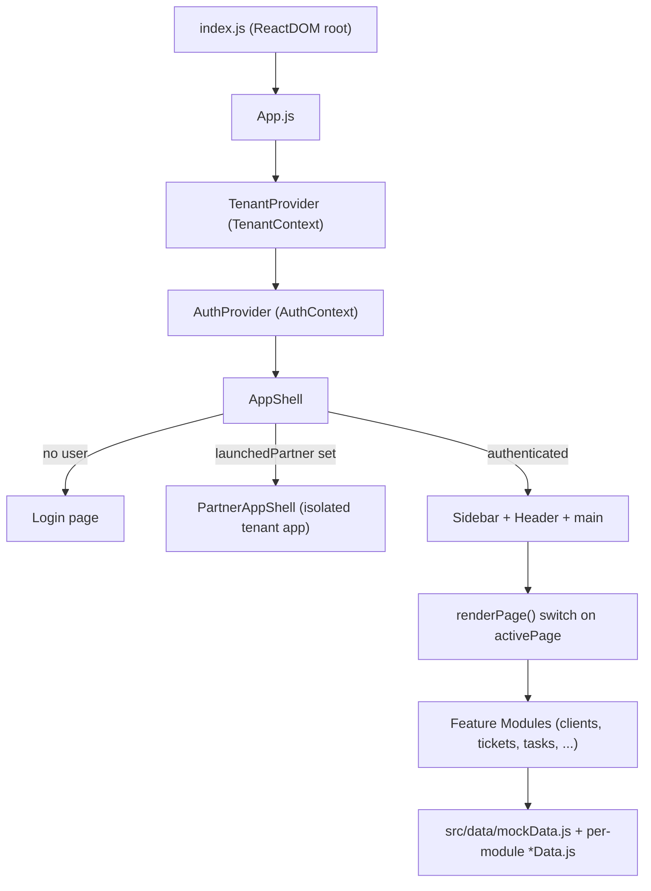
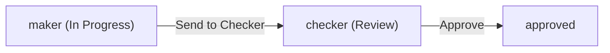

# FinOps 360 — Finance & Accounting Practice Management Platform

FinOps 360 is a **multi-tenant SaaS front-end** built for chartered-accountant (CA) firms and finance/accounting practices in India. It centralizes client management, compliance filings (GST / ITR / TDS), document handling, invoicing, task workflows, and team operations into a single role-based dashboard, and lets a master platform onboard and run multiple partner firms ("white-label" tenants) under one roof.

> Current state: this is a **front-end prototype / demo**. All data is in-memory mock data and there is no backend, database, or real authentication yet. See [What Is Real vs. Mock](#what-is-real-vs-mock) before planning implementation.

---

## Table of Contents

1. [Tech Stack](#tech-stack)
2. [High-Level Architecture](#high-level-architecture)
3. [Multi-Tenancy Model](#multi-tenancy-model)
4. [Roles & Responsibilities (RBAC)](#roles--responsibilities-rbac)
5. [Code Structure](#code-structure)
6. [Core Modules — Roles & Responsibilities](#core-modules--roles--responsibilities)
7. [Application Data Flow](#application-data-flow)
8. [Demo Credentials](#demo-credentials)
9. [Getting Started](#getting-started)
10. [What Is Real vs. Mock](#what-is-real-vs-mock)
11. [Recommended Next Steps for Implementation](#recommended-next-steps-for-implementation)

---

## Tech Stack

| Layer | Technology | Notes |
|---|---|---|
| Framework | **React 18** (`react`, `react-dom`) | Function components + hooks |
| Tooling | **Create React App** (`react-scripts` 5) | `npm start` / `npm run build` |
| Styling | **Tailwind CSS** (`tailwind.config.js`, `postcss.config.js`) | Utility-first, inline class names |
| Charts | **Recharts** | Dashboard / reports visualizations |
| Icons | **lucide-react** + emoji | Icons in shared UI + emoji in nav |
| Validation util | **ajv** | JSON schema validation (utility dependency) |
| Deployment | **Vercel** (`vercel.json`) | Static SPA hosting |

There is **no router library** (e.g. React Router). Navigation is handled manually through component state (`activePage`) — see [Application Data Flow](#application-data-flow).

---

## High-Level Architecture



Key ideas:

- **Two context providers wrap the whole app**: `TenantProvider` (which firm/tenant is active) and `AuthProvider` (who is logged in).
- **`AppShell`** is the orchestrator. It decides whether to show the login screen, the master platform, or an isolated partner portal, and it renders the correct module based on the active page and user role.
- **Each feature lives in its own folder** under `src/pages/` and is mounted by a `switch` statement in `App.js`.

---

## Multi-Tenancy Model

The platform supports two levels of organization, defined in [`src/context/TenantContext.js`](src/context/TenantContext.js):

- **Master tenant** (`finops`) — the FinOps 360 platform itself (`isMaster: true`).
- **Partner tenants** (`p001`, `p002`, `p003`, …) — independent CA firms onboarded onto the platform, each with their own branding (logo text, primary/accent colors), contact details, GSTIN, subscription `plan` (`starter` / `professional` / `master`), active status, and usage `stats`.

Each partner has its own user set in `PARTNER_USERS`, and launching a partner via the Partners module renders a **fully branded, isolated** `PartnerAppShell` with its own login, sidebar, and theme. This simulates white-label data isolation per firm.

`TenantContext` exposes: `tenants`, `activeTenant`, `activeTenantId`, and actions `addTenant`, `updateTenant`, `toggleTenantActive`, `switchTenant`.

---

## Roles & Responsibilities (RBAC)

Roles are defined in [`src/context/AuthContext.js`](src/context/AuthContext.js) as `ROLES`. Navigation per role is defined in [`src/components/layout/Sidebar.js`](src/components/layout/Sidebar.js), and the dashboard per role is mapped in `App.js` (`DASHBOARDS`).

| Role | Constant | Primary Responsibility | Modules / Nav Access |
|---|---|---|---|
| **Master Admin** | `MASTER_ADMIN` | Full platform owner; manages everything incl. partners | Dashboard, Clients, Tickets, Tasks, Documents, Invoices, Associates, Reports, Compliance, Notifications, **Partners**, Settings |
| **Sales** | `SALES` | Client acquisition & relationship | Dashboard, Clients, Tickets, Tasks, Documents, Invoices, Reports, Notifications |
| **HR** | `HR` | Team / associate management & compliance | Dashboard, Team (Associates), Documents, Compliance, Notifications |
| **Associate** | `ASSOCIATE` | Execution of filings & client work | Dashboard, My Tickets, My Tasks, Documents, Invoices, Clients, Reports, Compliance, Notifications |
| **Client** | `CLIENT` | End customer self-service portal | Dashboard, My Tasks, Documents, Messages, History |

Notes:

- The **master platform** uses display-name roles (`'Master Admin'`, `'Sales'`, etc.).
- **Partner tenants** use snake_case roles (`master_admin`, `sales`, `associate`) defined in `PARTNER_USERS` and `PARTNER_NAV` inside `PartnerAppShell.js`.
- Role gating is currently **UI-level only** (which nav items and dashboard render). There is no enforced authorization layer.

---

## Code Structure

```
finops360 ver2/
├── public/
│   ├── index.html            # SPA mount point (#root)
│   ├── manifest.json
│   └── robots.txt
├── src/
│   ├── index.js              # ReactDOM entry, renders <App/>
│   ├── App.js                # Providers + AppShell + page router (switch)
│   ├── index.css / App.css   # Global + Tailwind styles
│   │
│   ├── context/
│   │   ├── AuthContext.js    # ROLES, DEMO_USERS, login/logout, currentUser
│   │   └── TenantContext.js  # TENANTS, PARTNER_USERS, active tenant + actions
│   │
│   ├── components/
│   │   ├── layout/
│   │   │   ├── Sidebar.js     # Role-based navigation
│   │   │   └── Header.js      # Top bar (page title, mobile menu)
│   │   └── common/
│   │       └── UIComponents.js  # Shared UI: StageTag, PriorityTag, StatCard, etc.
│   │
│   ├── data/
│   │   └── mockData.js       # Shared mock: CLIENTS, TICKETS, TEAM, NOTIFICATIONS, STAGE
│   │
│   └── pages/
│       ├── Login.js          # Master platform login screen
│       ├── Dashboards.js     # Sales/HR/Associate/Client dashboards
│       ├── admin/
│       │   └── AdminDashboard.js
│       ├── clients/          # Clients list, profile, onboarding
│       ├── client/           # CLIENT-role self-service portal (tasks/docs/messages/history)
│       ├── tickets/          # Maker–Checker–Approved workflow (Kanban + list)
│       ├── tasks/            # Task board, list, form, detail, stats
│       ├── hr/               # Associates list, onboarding
│       ├── invoices/         # Invoice dashboard, list, builder, detail
│       ├── documents/        # Vault, viewer, upload, e-sign, audit trail
│       ├── compliance/       # Compliance calendar, stats, audit trail
│       ├── notifications/    # Feed, announcements, comm log, alert settings
│       ├── reports/          # ReportsModule (charts)
│       ├── partners/         # Tenant registry, partner onboarding, PartnerAppShell
│       └── settings/         # SettingsModule
├── package.json
├── tailwind.config.js
├── postcss.config.js
└── vercel.json
```

### Conventions

- Most feature folders use an **`index.js`** as the module entry, with sibling files for sub-views (e.g. `TicketsList.js`, `TicketDetail.js`, `CreateTicket.js`).
- Module-local mock data lives next to the module as **`*Data.js`** (e.g. `taskData.js`, `partnerData.js`, `complianceData.js`).
- Cross-module shared mock data lives in **`src/data/mockData.js`**.
- Styling is **Tailwind utility classes** written inline in JSX; there is little custom CSS.

---

## Core Modules — Roles & Responsibilities

| Module | Path | Responsibility | Key Sub-Components |
|---|---|---|---|
| **Auth** | `context/AuthContext.js`, `pages/Login.js` | Login/logout, demo users, role resolution | `AuthProvider`, `useAuth`, `ROLES` |
| **Tenant / Multi-tenancy** | `context/TenantContext.js` | Tenant registry, active tenant, partner switching | `TenantProvider`, `useTenant`, `TENANTS`, `PARTNER_USERS` |
| **Layout** | `components/layout/` | App chrome: role-based sidebar + header | `Sidebar`, `Header` |
| **Shared UI** | `components/common/UIComponents.js` | Reusable presentational atoms | `StageTag`, `PriorityTag`, `StatCard` |
| **Dashboards** | `pages/admin/AdminDashboard.js`, `pages/Dashboards.js` | Role-specific landing pages with KPIs/charts | `AdminDashboard`, `SalesDashboard`, `HRDashboard`, `AssociateDashboard`, `ClientDashboard` |
| **Clients** | `pages/clients/` | Manage firm clients & onboarding | `ClientsList`, `ClientProfile`, `OnboardClient` |
| **Client Portal** | `pages/client/` | Self-service for CLIENT role | `ClientTasks`, `ClientDocuments`, `ClientMessages`, `ClientHistory` |
| **Tickets** | `pages/tickets/` | Filing workflow via Maker → Checker → Approved | Kanban/list view, `TicketDetail`, `CreateTicket` |
| **Tasks** | `pages/tasks/` | Internal task tracking | `TaskBoard`, `TaskList`, `TaskForm`, `TaskDetail`, `TaskStats` |
| **HR** | `pages/hr/` | Manage associates / team | `AssociatesList`, `OnboardAssociate` |
| **Invoices** | `pages/invoices/` | Billing lifecycle | `InvoiceDashboard`, `InvoiceList`, `InvoiceBuilder`, `InvoiceDetail` |
| **Documents** | `pages/documents/` | Document vault + e-sign + audit | `DocumentVault`, `DocumentViewer`, `DocumentUploadModal`, `ESignWorkflow`, `AuditTrail` |
| **Compliance** | `pages/compliance/` | Filing deadlines & compliance tracking | `ComplianceCalendar`, `ComplianceStats`, `AuditTrail` |
| **Notifications** | `pages/notifications/` | Alerts, announcements, comms | `NotificationFeed`, `Announcements`, `CommLog`, `AlertSettings` |
| **Reports** | `pages/reports/ReportsModule.js` | Analytics & performance reporting | Recharts visualizations |
| **Partners** | `pages/partners/` | Onboard & launch partner firms (white-label) | `PartnerList`, `PartnerForm`, `PartnerPortal`, `PartnerAppShell` |
| **Settings** | `pages/settings/SettingsModule.js` | Configuration / preferences | `SettingsModule` |

### Ticket workflow (Maker–Checker–Approved)

The Tickets module models the standard CA-firm review chain. Tickets move through three stages and can be promoted forward:



See [`src/pages/tickets/index.js`](src/pages/tickets/index.js) for the Kanban + list implementation and the `promote()` state transition.

---

## Application Data Flow

There is no URL router. The active screen is tracked in `AppShell` via `useState('dashboard')` and selected through a `switch`:

```62:91:src/App.js
  const renderPage = () => {
    switch (activePage) {
      case 'dashboard':         return <DashboardComponent setActivePage={setActivePage} />;
      case 'clients':
      case 'onboard-client':    return <ClientsModule />;
      case 'tickets':           return <TicketsModule />;
      // ...
      case 'partners':          return <PartnersModule onLaunchPartner={p => setLaunchedPartner(p)} />;
      // ...
      default:                  return <ComingSoon page={activePage} />;
    }
  };
```

Flow summary:

1. `index.js` renders `<App/>`.
2. `App` wraps everything in `TenantProvider` → `AuthProvider` → `AppShell`.
3. If no `currentUser`, `AppShell` shows `Login`.
4. After login, `Sidebar` (role-based nav) updates `activePage`; `renderPage()` mounts the matching module.
5. Clicking "Launch" on a partner sets `launchedPartner`, which swaps the whole UI for the isolated, branded `PartnerAppShell` (with its own login + nav). "Exit" returns to the master platform.
6. Modules read/update **in-memory mock data** via local `useState`.

---

## Demo Credentials

Master platform users (from `DEMO_USERS` in `AuthContext.js`):

| Role | Email | Password |
|---|---|---|
| Master Admin | `admin@finops360.in` | `admin123` |
| Sales | `sales@finops360.in` | `sales123` |
| HR | `hr@finops360.in` | `hr123` |
| Associate | `associate@finops360.in` | `assoc123` |
| Client | `client@example.com` | `client123` |

Partner-tenant users (from `PARTNER_USERS` in `TenantContext.js`), e.g.:

| Firm | Email | Password |
|---|---|---|
| Mehta & Associates (`p001`) | `admin@mehtaassociates.in` | `mehta123` |
| Reddy Tax Consultants (`p002`) | `admin@reddytax.in` | `reddy123` |
| Sharma & Co. CAs (`p003`) | `admin@sharmaandco.in` | `sharma123` |

> These are hard-coded demo credentials for prototyping only. Do not ship them to production.

---

## Getting Started

Prerequisites: **Node.js 16+** and npm.

```bash
# from the "finops360 ver2" directory
npm install
npm start          # dev server at http://localhost:3000
npm run build      # production build into /build
```

Deployment is configured for **Vercel** via `vercel.json` (static SPA).

---

## What Is Real vs. Mock

| Concern | Status |
|---|---|
| Authentication | Mock — credentials compared against hard-coded arrays in memory |
| Authorization | UI-only — role controls nav/dashboard, not enforced server-side |
| Data persistence | None — all state is in React `useState`; refresh resets everything |
| Backend / API | None — no server, no database, no network calls |
| Multi-tenant isolation | Simulated in the UI (`PartnerAppShell`); not enforced by a backend |
| Partner module pages | Most render a placeholder "isolated data" screen, not real per-tenant data |
| Routing | Manual `activePage` state, not URL-based |

---

## Recommended Next Steps for Implementation

These are observations to consider before building out the real product (not yet implemented):

- **Add a backend + database** for clients, tickets, tasks, invoices, documents, compliance, and tenants; replace the `mockData.js` / `*Data.js` files with API calls.
- **Real auth & RBAC** (e.g. JWT/session + server-side role enforcement), replacing `DEMO_USERS` / `PARTNER_USERS`.
- **True tenant isolation** — scope every query/mutation by `tenantId`; have each module accept and filter by tenant rather than `PartnerAppShell` showing placeholders.
- **Introduce a router** (React Router) so pages are URL-addressable, deep-linkable, and back-button friendly.
- **Persist UI state** and wire real document storage / e-sign / notifications providers.
- **Extract repeated nav definitions** (`NAV_ITEMS` in `Sidebar.js` and `PARTNER_NAV` in `PartnerAppShell.js`) into a shared config.

---

*This README documents the project as it currently exists in the repository to support planning before implementation.*
